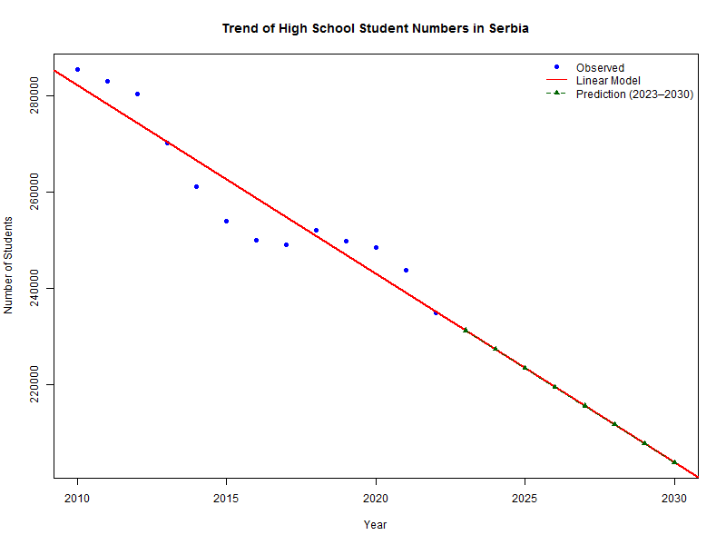

# Modeling the Number of High School Students in Serbia (2010–2030)

This project analyzes the decline in the number of high school students in Serbia based on official statistical data from 2010 to 2022. A linear regression model is used to project future values until 2030.

## Contents

- `number1.csv` — Source data: years and number of students
- `analiza_ucenika.R` — R script: loads data, fits linear model, creates visualization
- `student_trend_serbia.png` — Exported visualization of the trend and projection

## How to Run

1. Open `analiza_ucenika.R` in R or RStudio.
2. Ensure that `number1.csv` is in the same directory.
3. Run the script to generate the regression and export the PNG plot.

## Result

The linear model shows a consistent yearly decrease. If the trend continues, the number of students will fall below 200,000 by 2030.

## Example Plot

## Author

Dejan Cvijetic (Mathematics Professor, Applied Math Enthusiast)

